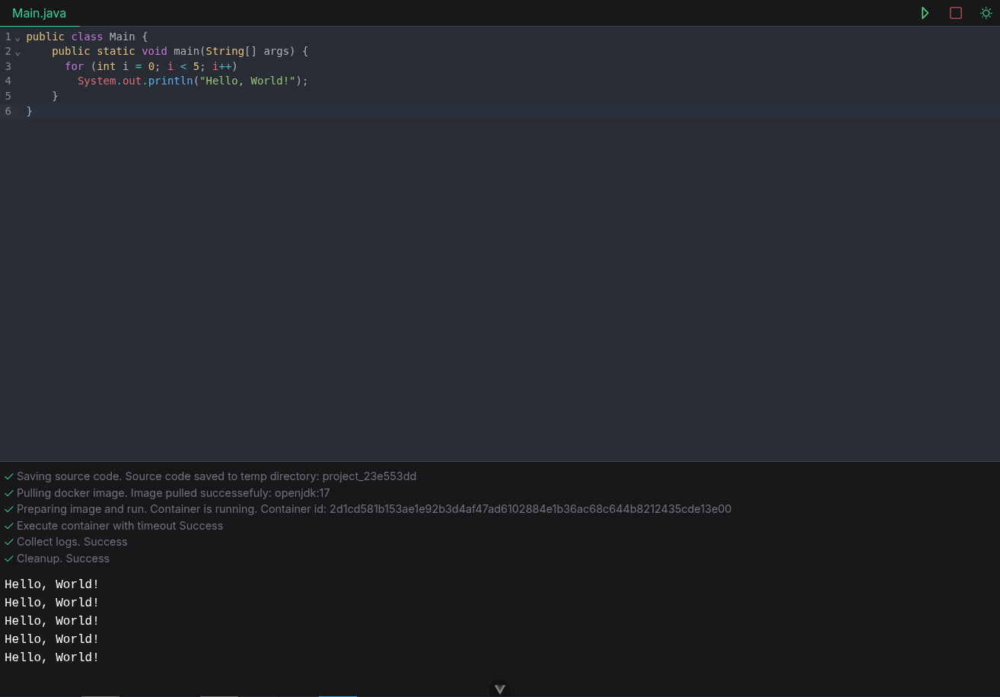

## Java Code Execution Sandbox
A simple web-based Java compiler that allows users to write, compile, and run Java code directly in the browser.



#### 🚀 Quick Start
```bash
# Build the backend JAR file first
cd java-compiler-backend
./mvnw clean package

# Then start all services
docker-compose up -d
```
Access the application at: http://localhost:5174

#### 📋 Features
- Online Java Compilation - Write and compile Java code in real-time
- Docker-Based Execution - Each compilation runs in isolated Docker containers
- Vue.js Frontend - Modern, responsive web interface
- REST API Backend - Spring Boot API with JAR packaging
- Single-File Support - Compile individual Java files

#### 🏗️ Architecture
- The system consists of three main services:
- Frontend (Vue.js app) - User interface for code editing
- Backend API (Spring Boot JAR) - Handles compilation requests
- Docker-in-Docker - Provides isolated execution environments

#### 📚 Detailed Documentation
- Frontend Setup - [Vue.js application details](java-compiler-frontend/README.MD)
- Backend API - [Spring Boot compilation service and build instructions](java-compiler-backend/README.MD)

#### 🐳 Docker Services
- compiler-app: Vue.js frontend (port 5174)
- compiler-api: Java compilation API - Spring Boot JAR (port 8080)
- dind: Docker engine for code execution isolation

<hr>

####  ⚠️  Note: 
Backend JAR must be built with Maven before running Docker Compose. Currently supports single Java file compilation.
